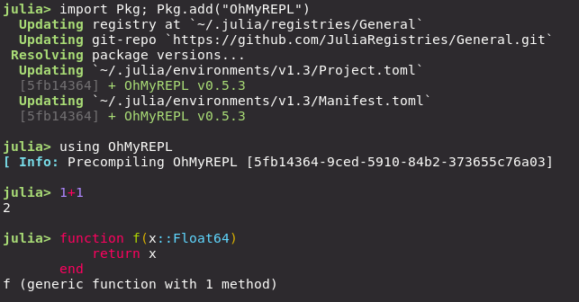

# [Creating a sysimage with OhMyREPL](@id manual-omr)

[OhMyREPL.jl](https://github.com/KristofferC/OhMyREPL.jl) is a package that
enhances the REPL with, for example, syntax highlighting.  It does, however,
come with a bit of a startup time increase, so compiling a new system image
with OhMyREPL included is useful.  Importing the OhMyREPL package is not the
only factor that contributes to the extra load time from using OhMyREPL. In
addition, the time of compiling functions that OhMyREPL uses is also a factor.
Therefore, we also want to do "Profile Guided Compilation" (PGC), where we
record what functions gets compiled when using OhMyREPL, so they can be cached
into the system image. OhMyREPL is a bit different from most other packages in
that it is used interactive. Normally to do PGC with PackageCompiler we pass a
script to to execute as the `precompile_execution_file` which is used to
collect compilation data, but in this case, we will use Julia to manually
collect this data.

First install `OhMyREPL` in the global environement using `import Pkg;
Pkg.add("OhMyREPL")`.  Run `using OhMyREPL` and write something (like `1+1`).
It should be syntax highlighted, but you might have noticed that there was a bit
of a delay before the characters appeared. This is the extra latency from using
the package that we want to get rid off.



The first goal is to have Julia emit the functions it compiles when running
OhMyREPL.  To this end, start Julia with the
`--trace-compile=ohmyrepl_precompile.jl` flag. This will start a standard
Julia session but all functions that get compiled are output to the file
`ohmyrepl_precompile.jl`. In the Julia session, load OhMyREPL, use the REPL a bit
so that the functionality of OhMyREPL is exercised. Quit Julia and look into
the file `ohmyrepl_precompile`.  It should be filled with lines like:

```
precompile(Tuple{typeof(OhMyREPL.Prompt.insert_keybindings), Any})
precompile(Tuple{typeof(OhMyREPL.__init__)})
```

These are functions that Julia compiled. We now just tell `create_sysimage` to
use these precompile statements when creating the system image:

```julia
PackageCompiler.create_sysimage(:OhMyREPL; precompile_statements_file="ohmyrepl_precompile.jl", replace_default=true)
```

Restart julia and start typing something. If everything went well you should
see the typed text become highlighted with a significantly smaller delay than
before creating the new system image


!!! note
    If you want to go back to the default sysimage you can run

    ```julia
    PackageCompiler.restore_default_sysimage()
    ```
